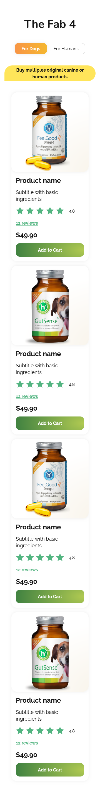
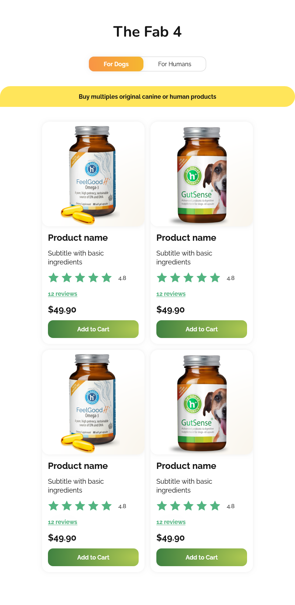

# Products List React Application

This is a React application that displays a list of products fetched from a JSON server. The application allows users to filter products based on their categories (e.g., Dogs, Humans).

## Live demo [_here_](https://megaclinic.ultra-violet.codes)

## Table of Contents

- [Features](#features)
- [Technologies Used](#technologies-used)
- [Screenshots](#screenshots)
- [Getting Started](#getting-started)
  - [Prerequisites](#prerequisites)
  - [Installation](#installation)
  - [Running the Application](#running-the-application)
- [API](#api)
- [Folder Structure](#folder-structure)
- [Contact](#contact)

## Features

- Fetches product data from a local JSON server.
- Filters products by categories.
- Displays product details including name, description, price, and image.
- Responsive design for mobile and desktop views.

## Technologies Used

- React
- TypeScript
- Tailwind CSS
- json-server
- Create React App

## Screenshots





## Getting Started

### Prerequisites

Make sure you have the following installed on your machine:

- [Node.js](https://nodejs.org/) (version 14 or later)
- [npm](https://www.npmjs.com/get-npm) (comes with Node.js)

### Installation

1. Clone the repository:

   ```bash
   git clone https://github.com/Wiolinek/products-list.git
   ```

2. Install the dependencies:

    ```bash
    cd frontend
    npm ci
    ```

3. Set up the JSON server:

    ```bash
    cd json-server
    npm ci
    ```

### Running the Application

1. Client:

   ```bash
   npm run dev
   ```

   frontend is running on http://localhost:3000

2. Json-server:

    ```bash
    npm run start:json-serve
    ```
    server is runnig on http://localhost:5000
    

## API

The application fetches data from the following endpoint:

- Products: http://localhost:5000/products

## Folder Structure

Here's an overview of the project's folder structure:

    /frontend
        ├── /public
        │   └── /images          # Product images
        ├── /src
        │   ├── /assets          # Static assets and icons
        │   ├── /components      # React components
        │   ├── /hooks           # Custom hooks
        │   ├── /interfaces      # TypeScript interfaces
        │   └── App.tsx          # Main application file
        ├── db.json              # Mock data for json-server
        ├── package.json         # NPM package configuration
    /json-server
        ├── db.json              # Mock data for json-server
        ├── package.json         # NPM package configuration
    /README.md                   # Project documentation

## Contact

Created by [@Wiolinek](https://github.com/Wiolinek) - feel free to contact me!